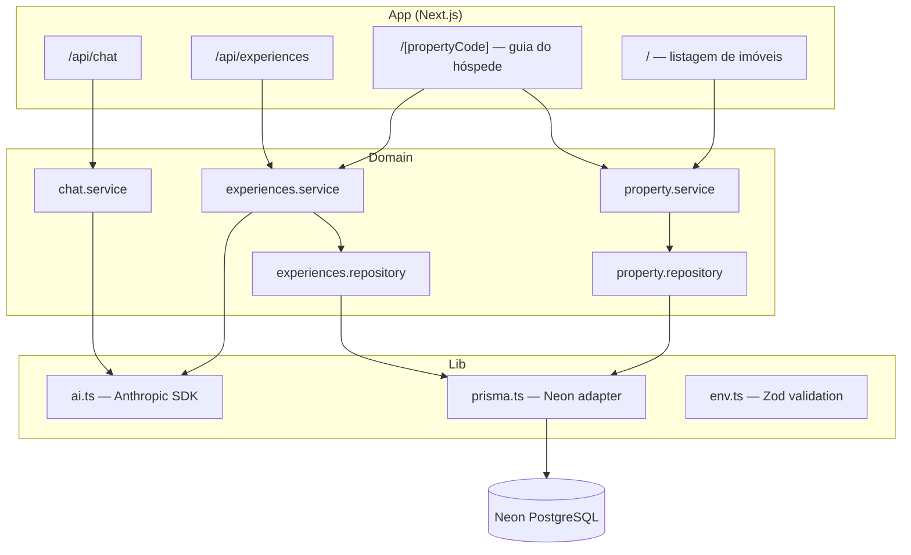
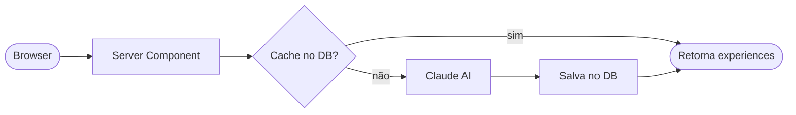

# Guest Guide

> Guia digital inteligente para hóspedes — gerado por IA, personalizado por imóvel.

[](https://nextjs.org)
[](https://typescriptlang.org)
[](https://prisma.io)
[](https://anthropic.com)
[](https://tailwindcss.com)
[](https://guest-guide-brown.vercel.app/)

**Demo:** [guest-guide-brown.vercel.app](https://guest-guide-brown.vercel.app/)

## Sobre

Guest Guide é uma aplicação web que gera automaticamente um guia personalizado para hóspedes de imóveis de temporada. A partir dos dados do imóvel, a IA (Claude) produz recomendações de restaurantes, atrações, dicas sazonais e uma mensagem de boas-vindas. O hóspede também pode tirar dúvidas com um assistente virtual integrado ao contexto do imóvel.

## Stack

| Tecnologia | Versão | Papel |
|---|---|---|
| Next.js (App Router) | 16.2 | Framework full-stack, SSR e streaming |
| React | 19 | UI com Server Components |
| TypeScript | 5 | Tipagem estática |
| Prisma | 7 | ORM com cliente gerado em `src/generated/prisma` |
| Neon (PostgreSQL serverless) | — | Banco de dados |
| Anthropic SDK (Claude) | 0.98 | Geração de experiences e chat |
| Tailwind CSS | 4 | Estilização via CSS custom properties (`--sz-*`) |
| Vitest | 4 | Testes unitários |
| Zod | 4 | Validação de variáveis de ambiente |

## Arquitetura



Cada domínio segue o padrão `service` (regras de negócio) → `repository` (acesso ao banco). Services nunca importam outros services — podem acessar repositories de domínios vizinhos quando necessário.

Os componentes de UI seguem **Atomic Design**:

| Nível | Componentes |
|---|---|
| Atoms | `InfoRow`, `RuleItem`, `StatItem`, `Divider` |
| Molecules | `QuickCard`, `SectionCard` |
| Organisms | `ExperiencesSection`, `ExperiencesSkeleton`, `VirtualAssistant` |

## Fluxo de dados — Experiences (IA)



O componente `ExperiencesSection` fica dentro de um `<Suspense>`, o que permite o streaming do restante da página enquanto a IA processa.

## Decisões técnicas

| Decisão | Alternativa considerada | Motivo |
|---|---|---|
| Neon como banco de dados | PostgreSQL self-hosted | Setup em menos de 2 minutos, free tier generoso e integração nativa com Vercel — escolha orientada ao baixo tempo de desenvolvimento |
| Adapter Neon (`@prisma/adapter-neon`) + WebSocket | Driver padrão do Prisma | Requisito do Neon serverless — conexões via HTTP/WS sem pool persistente |
| Services não importam outros services | Chamadas cross-service livres | Evita acoplamento; services podem importar repositories de outros domínios quando necessário |
| Delay artificial de 2s no cache hit | Retornar imediatamente | Preserva a UX do skeleton — sem o delay, o conteúdo cacheado surgiria sem a animação de carregamento |
| Singleton do cliente Anthropic com `globalThis` | `new Anthropic()` por request | Evita reconexões a cada hot-reload no dev; comportamento idêntico em produção |
| Validação de env vars com Zod no startup | Falha silenciosa em runtime | Erros de configuração são detectados imediatamente ao subir a aplicação |

## Como rodar

**Pré-requisitos:** Node.js 20+, conta [Neon](https://neon.tech), chave de API [Anthropic](https://console.anthropic.com).

```bash
# 1. Instalar dependências
npm install

# 2. Configurar variáveis de ambiente
cp .env.example .env
```

| Variável | Descrição |
|---|---|
| `DATABASE_URL` | Connection string do Neon PostgreSQL |
| `AI_API_KEY` | Chave de API da Anthropic |
| `AI_MODEL` | Modelo a usar, ex: `claude-sonnet-4-6` |

```bash
# 3. Criar banco e aplicar migrations
npx prisma migrate dev

# 4. Popular com dados de exemplo (4 imóveis)
npx prisma db seed

# 5. Iniciar servidor de desenvolvimento
npm run dev
```

Acesse [http://localhost:3000](http://localhost:3000).

## Testes

```bash
npm run test          # execução única
npm run test:watch    # modo watch
```

Testes unitários com **Vitest** cobrindo services e repositories dos domínios `property`, `experiences` e `chat`.

## Débitos técnicos

| Área | Débito | Impacto |
|---|---|---|
| Performance | Delay artificial de 2s no cache hit penaliza usuários com experiences já geradas | UX degradada |
| IA | Experiences cacheadas sem TTL ou invalidação — conteúdo desatualizado (ex: restaurante fechado) é servido indefinidamente | Confiabilidade do conteúdo gerado |
| Custo | Sem rate limiting nos endpoints `/api/chat` e `/api/experiences` — qualquer um com o código do imóvel pode gerar requests ilimitados | Exposição de custo na API da Anthropic |
| Segurança | `propertyCode` funciona como senha por obscuridade — sem autenticação real | Qualquer pessoa que saiba o código acessa o guia |
| Robustez | JSON retornado pela IA vai direto ao banco sem validação de schema — falhas de formato só aparecem em runtime | Erros silenciosos em caso de resposta inesperada do modelo |
| Portabilidade | Adapter `@prisma/adapter-neon` é específico do Neon — migrar para outro PostgreSQL exige trocar adapter e cliente | Acoplamento ao provedor de banco |
| Assistente virtual | Rate limit da Anthropic pode causar esperas de 60s+ na primeira mensagem do chat (ver abaixo) | Percepção de travamento |

### Rate limit no assistente virtual

O plano gratuito da Anthropic impõe um limite de **50.000 tokens de entrada por minuto** para o modelo usado no chat (`claude-haiku-4-5`). Cada mensagem consome entre 1.100 e 1.500 tokens (prompt do sistema + histórico). Em cenários de uso intenso ou durante testes, esse limite é atingido rapidamente.

Quando o limite é atingido, a API retorna um erro `429` com um cabeçalho `Retry-After` de mais ou menos 60 segundos. O SDK da Anthropic aguarda esse intervalo e faz uma nova tentativa automaticamente - sem nenhum feedback visual para o usuário.

**Mitigação temporária implementada:** o assistente virtual exibe uma mensagem no próprio chat após 10 segundos sem resposta:

> *"O serviço está sobrecarregado no momento. Já irei te responder!"*

A requisição continua em andamento; quando a API responde (após o retry do SDK), o texto chega normalmente. Isso evita a sensação de travamento sem alterar o comportamento de retry.

**Solução definitiva:** fazer upgrade do plano na [Anthropic Console](https://console.anthropic.com) para aumentar os limites de tokens por minuto.

## Próximos passos

### CRUD de imóveis, hóspedes e locatários
- [ ] API REST para criação, edição e remoção de imóveis
- [ ] Modelo e CRUD de hóspedes (guests) com histórico de estadias
- [ ] Modelo e CRUD de locatários (tenants) — proprietários dos imóveis
- [ ] Painel administrativo web

### Observabilidade
- [ ] Logs estruturados (JSON) com níveis e contexto de request
- [ ] Métricas de uso da IA (latência, tokens consumidos, cache hit rate)
- [ ] Alertas e dashboards

### Docker
- [ ] `Dockerfile` multi-stage para produção
- [ ] `docker-compose.yml` para desenvolvimento local (app + PostgreSQL)
- [ ] Pipeline de CI com build e push de imagem

## Licença

[MIT](LICENSE)
